I got tired of relying on browser extensions to block ads and decided to build the thing myself: a local, containerized DNS filter running on my Mac that blocks ads and trackers before they ever load, with encrypted DNS on top so my traffic isn't sitting in plaintext on whatever café WiFi I happen to be on.

## Overview / Purpose

I wanted to actually understand DNS resolution instead of just trusting whatever an extension or my OS defaults to. So I built Pi-hole in Docker, locked it down, and added encrypted DNS on top of that — partly because it's genuinely useful, partly because I use public WiFi a lot and wanted to stop being an easy target on the wire.

Tools I used:

| Tool | Category |
| --- | --- |
| Pi-hole | DNS-layer filtering / sinkhole |
| dnscrypt-proxy | Encrypted upstream DNS (DNSCrypt protocol) |
| Quad9 (filtered) | Upstream recursive resolver, also blocks known-malicious domains |
| Docker / Docker Compose | Containerization, service isolation |
| DNSSEC | DNS response authentication |
| OISD (big list) | Aggregated, actively-maintained blocklist covering ads, trackers, and malware |
| Phishing Army | Blocklist focused specifically on active phishing domains |
| StevenBlack's hosts list | Pi-hole's default blocklist, included out of the box — general ad/tracker coverage baseline underneath the other two |

## Architecture / Setup

This is local and single-machine (my Apple Silicon MacBook), not network-wide, on purpose. I wanted to actually understand the whole DNS stack before scaling it out to protect an entire network.

Two containers do the work: Pi-hole handles filtering and acts as my DNS server, and dnscrypt-proxy sits behind it, talking to Quad9 over encrypted DNSCrypt. My Mac's DNS points at `127.0.0.1`, so everything flows through this before it hits the real internet.

| Component | What it does |
| --- | --- |
| Pi-hole | Gets every DNS query from my Mac, checks it against blocklists, sinkholes matches, forwards the rest to `dnscrypt-proxy#53` — Pi-hole's own built-in upstream checkboxes (Google, Cloudflare, Quad9, etc.) are all left unchecked; this Custom DNS entry is the only upstream Pi-hole uses. |
| dnscrypt-proxy | Takes what Pi-hole forwards and sends it to Quad9 encrypted — Quad9 is chosen inside dnscrypt-proxy's own config (`dnscrypt-proxy.toml`), not in Pi-hole — using X25519 key exchange, XChaCha20-Poly1305 encryption, Ed25519 authentication, so nothing leaves my machine as plaintext DNS. |

```
DNS Resolution Flow
├── Mac (Apple Silicon)
│   └── DNS setting → 127.0.0.1
│
├── pihole (Docker container, listens on 127.0.0.1:53)
│   ├── Blocklists
│   │   ├── StevenBlack's hosts    — Pi-hole default, included out of the box
│   │   ├── OISD (big list)       — ads / trackers / malware
│   │   └── Phishing Army         — active phishing domains
│   ├── DNSSEC validation         → off (see Bug 3)
│   └── Custom DNS upstream       → dnscrypt-proxy#53
│
├── dnscrypt-proxy (Docker container, internal port 53)
│   ├── Config                    → dnscrypt-proxy.toml
│   ├── Protocol                  → DNSCrypt (X25519 / XChaCha20-Poly1305 / Ed25519)
│   └── Upstream                  → Quad9 (quad9-dnscrypt-ip4-filter-pri)
│
└── Quad9 (filtered resolver)
    ├── DNSSEC validation         → on, authoritative
    └── Known-malicious domain filtering
```

*Note on that middle box: `dnscrypt-proxy#53` is the service name over the internal container port. `5053` only exists as the host-side mapping, visible from the Mac — I mixed those up early on, which is exactly what Bug 2 below is about.*

## The Privacy & Threat Model

Every choice here came from an actual concern, not a default I just went with:

| Concern | Why it matters | How I addressed it |
| --- | --- | --- |
| Third-party DNS seeing everything I resolve | A public resolver sees every domain I visit, tied to my IP, for as long as they keep logs. | Picked Quad9 specifically — no-logging stance, plus it filters known-malicious domains on its own. |
| Plaintext DNS on public WiFi | I'm regularly on café/airport WiFi, where an attacker on the same network could read or spoof my DNS traffic. | Encrypted everything via DNSCrypt. I actually went back and forth on DoH vs. DNSCrypt for this — DNSCrypt doesn't depend on the CA system at all, so there's no risk of a compromised or coerced certificate authority on a shady network, and it skips the plaintext "bootstrap" lookup that DoH needs before it can even start encrypting. |
| DNS spoofing / cache poisoning | A forged response could quietly redirect me to an attacker's server. | Turned on DNSSEC in Pi-hole so responses get validated against the real authoritative chain. |
| My dashboard or DNS port being reachable by anything else on the network | No reason for that to be possible on a single-machine setup. | Both containers bound to `127.0.0.1` only. |
| Container config accidentally widening my attack surface | Easy to over-mount volumes or over-grant permissions without noticing. | Only the two volumes Pi-hole actually needs, no extra capabilities, password lives in `.env` instead of hardcoded. |
| Relying on a single blocklist source | Any one list can lag on new threats or miss categories it wasn't built for. | Pi-hole ships with StevenBlack's hosts list by default; layered OISD's big list (broad ad/tracker/malware coverage) and Phishing Army (phishing-specific, updated independently) on top of it, so no single list is a point of failure — Quad9's own filtering underneath is separate from this and covered below. |

## Findings

- [x] **DNS interception and filtering actually working**
  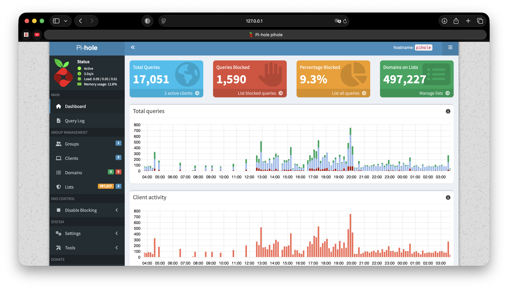
  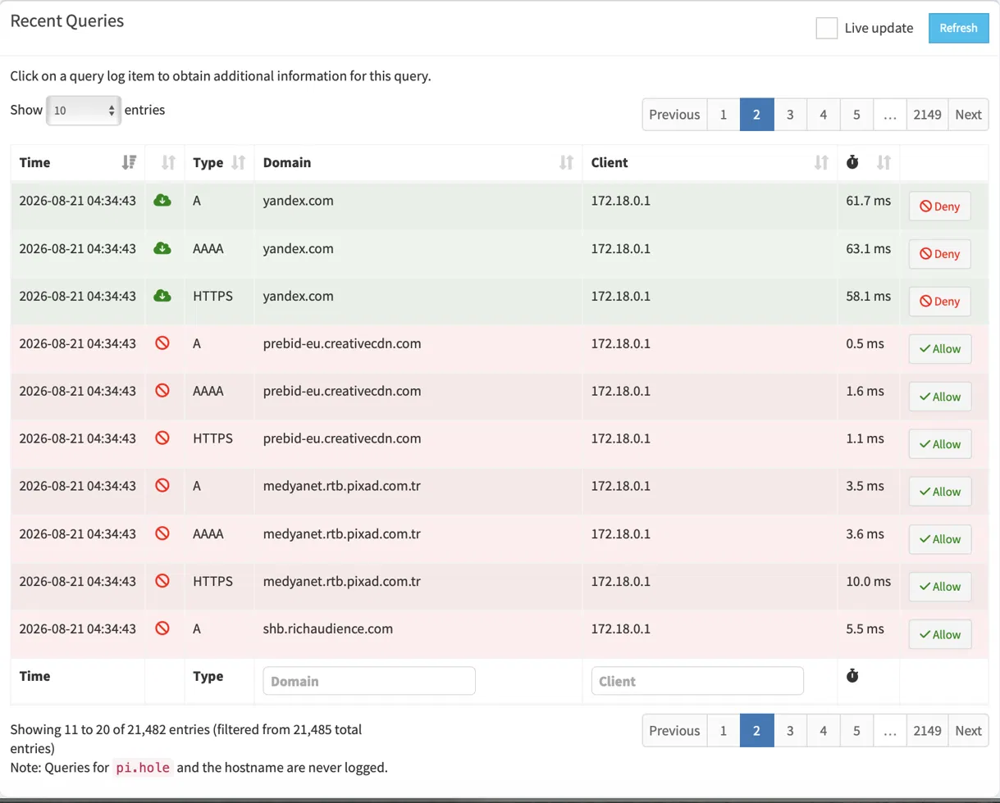

- [x] **Encrypted upstream confirmed**
  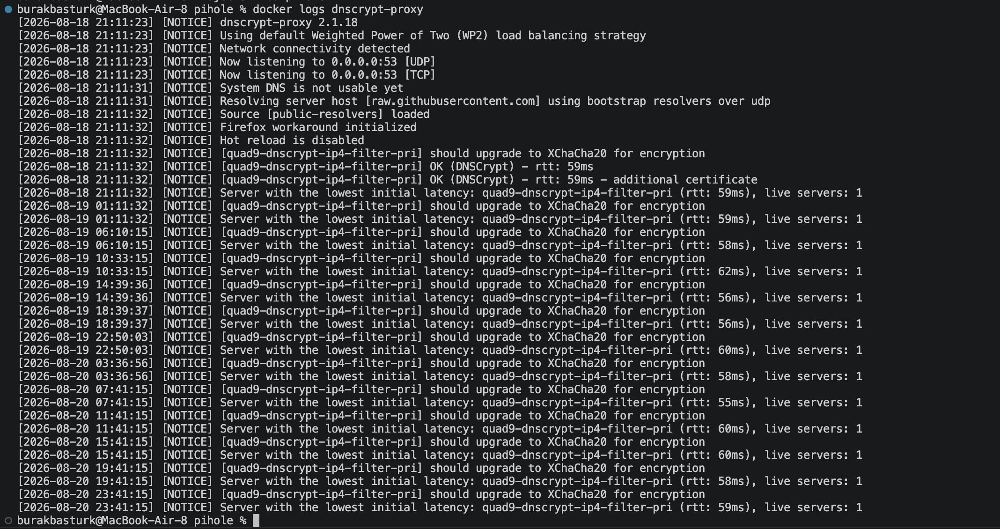
  *Confirmed via `docker logs dnscrypt-proxy` — connected to `quad9-dnscrypt-ip4-filter-pri` at ~59ms, no errors.*

- [x] **DNSSEC handled correctly — on at Quad9, off in Pi-hole**
  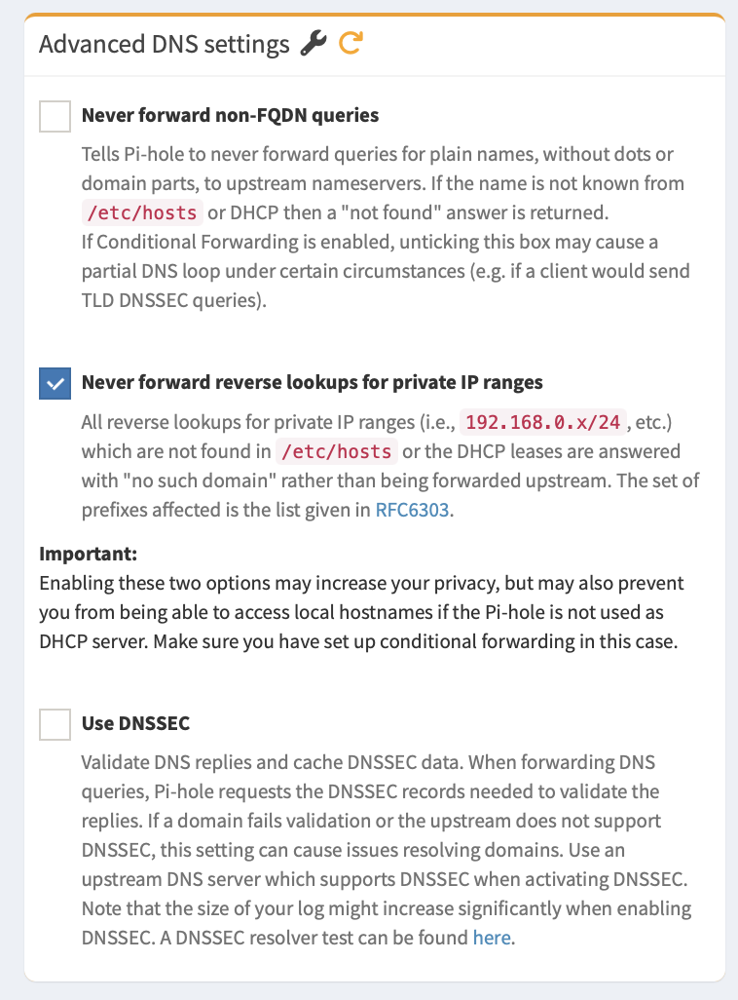
  *My original plan here was to just flip Pi-hole's DNSSEC toggle on and call it done — that's genuinely what I set out to do. Turned out Quad9 already validates DNSSEC before handing dnscrypt-proxy a response, and doesn't pass along the raw signature data for Pi-hole to re-check independently. So Pi-hole asked for proof it could never get and rejected everything. Left unchecked on purpose now — see Bug 3 below for how I found this.*

- [x] **Survives sleep/wake and reboots without babysitting**
  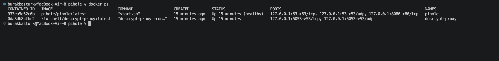
  *Docker Desktop set to launch at login, both containers set to `restart: unless-stopped` — together that means I never have to manually restart anything.*

- [x] **Actually replaced my browser extensions**
  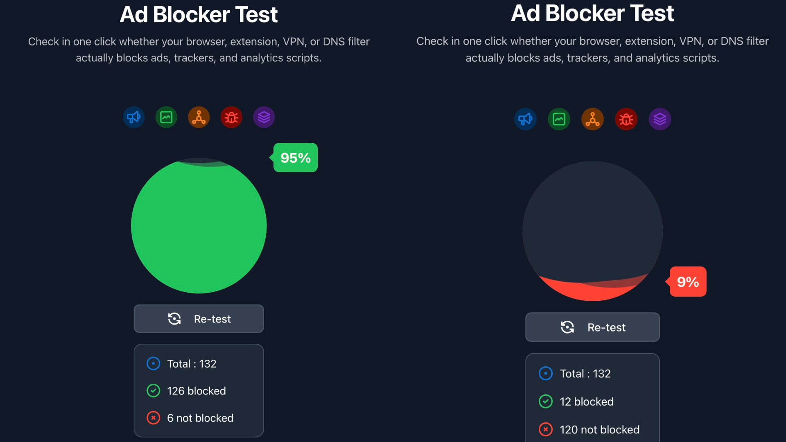
  *Ran with extensions disabled for a couple weeks first before deleting them for good.*

- [x] **Three blocklists deep, not just Pi-hole's default**
  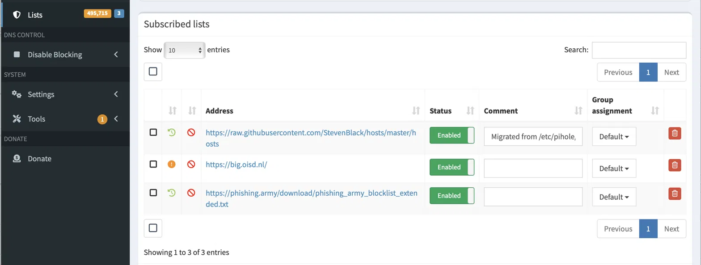
  *StevenBlack's hosts list ships with Pi-hole by default — I layered OISD's big list on top for broad ad/tracker/malware coverage, and Phishing Army specifically for active phishing domains, updated independently of the other two. Three independent filtering layers now (blocklists, Quad9's own filtering, DNSSEC validation), so no single source is a point of failure.*

- [x] **Holding up over real, longer-term use**
  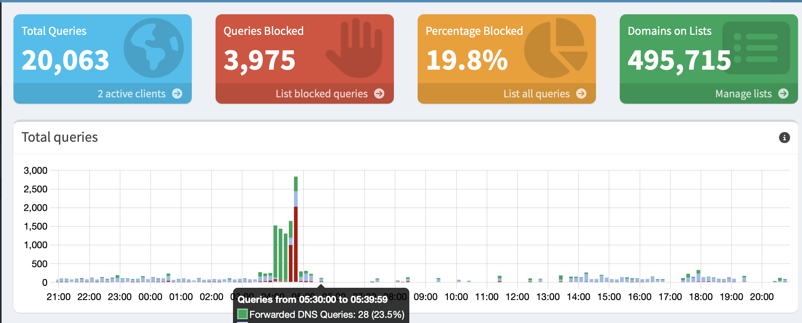
  *Pi-hole v6 doesn't actually have a multi-day trend graph in the web UI — the 24-hour chart resets daily. What proves this held up isn't a graph, it's the cumulative counters: 20,063 total queries and 495,715 domains on the lists, captured after roughly a week of normal daily use, not five minutes after setup.*

## Three Bugs That Taught Me More Than the Working Setup Did

Getting this running cleanly took three separate debugging sessions after it *looked* done. All three turned out to be more instructive than the parts that worked on the first try.

### Bug 1: cloudflared was already dead

My original plan was `cloudflared proxy-dns` in front of Pi-hole for DoH. Instead it logged this on repeat:

```
ERR DNS Proxy is no longer supported since version 2026.2.0
dns-proxy feature is no longer supported
```

The container looked "running" — `docker ps` would've shown it happily `Up` — but it wasn't doing anything. I checked Cloudflare's own changelog instead of assuming I'd misconfigured something, and confirmed `proxy-dns` had been deprecated in November 2025 and pulled entirely from new releases in February 2026.

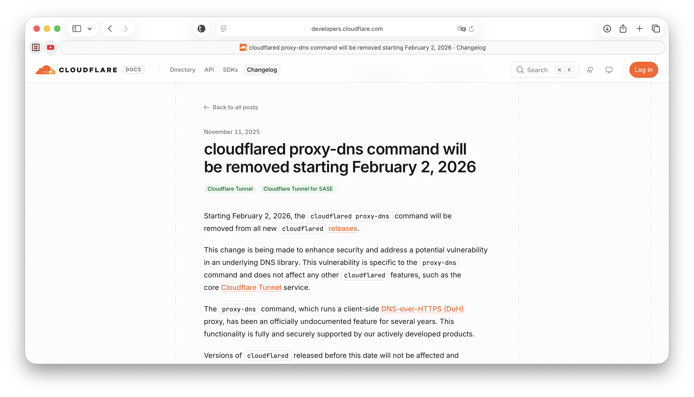

I swapped in `dnscrypt-proxy`, still actively maintained, and used the moment to actually reconsider DoH vs. DNSCrypt rather than defaulting to my original plan out of habit.

### Bug 2: `127.0.0.1` doesn't mean what I thought it meant inside Docker

Once dnscrypt-proxy was running and I pointed Pi-hole at `127.0.0.1#5053`, everything looked fine — dashboard loaded, containers showed healthy, dnscrypt-proxy's own logs showed a clean connection to Quad9. But new domains I hadn't visited before just hung forever, while anything already cached still worked.

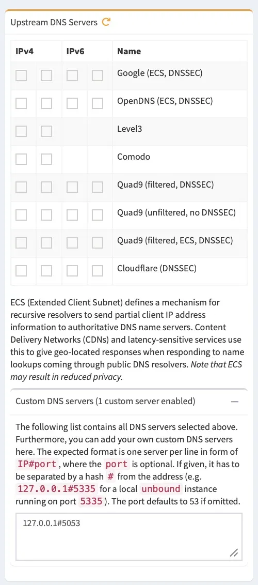

`/var/log/pihole/pihole.log` gave it away:

```
dnsmasq[52]: query[A] mobile.events.data.microsoft.com from 172.18.0.1
dnsmasq[52]: forwarded mobile.events.data.microsoft.com to 127.0.0.1#5053
dnsmasq[52]: query[A] mobile.events.data.microsoft.com from 172.18.0.1
dnsmasq[52]: forwarded mobile.events.data.microsoft.com to 127.0.0.1#5053
```

Same domain, forwarded to the same dead end, over and over, seconds apart — that's a client retrying because it never got an answer. Every query in the log was landing on `127.0.0.1#5053` and just never coming back.

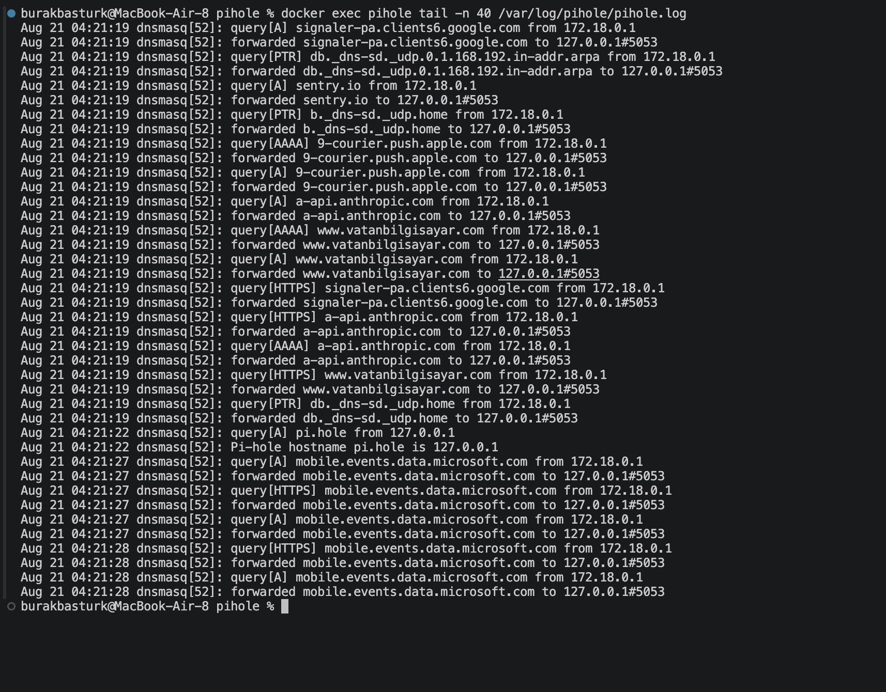

Running `docker exec pihole dig google.com @127.0.0.1` — from *inside* the Pi-hole container — timed out too, identically.

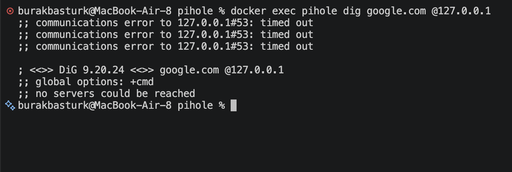

That was the tell: I was asking Pi-hole to reach `127.0.0.1`, but each Docker container has its own isolated loopback interface. From inside Pi-hole's container, `127.0.0.1` means Pi-hole itself, not dnscrypt-proxy. I'd pointed Pi-hole at a port on its own container that nothing was listening on — a dead end that explained every symptom: cached answers still resolved instantly (no forwarding needed), anything new just hung (forwarding target unreachable), and dnscrypt-proxy's own logs looked perfectly healthy the whole time because it was never actually being asked anything.

The fix was switching to Docker's service-name networking: `dnscrypt-proxy#53` (the service name from `docker-compose.yml`, and dnscrypt-proxy's *internal* container port — not the `5053` host-side mapping, which only exists from the Mac's perspective, not from inside another container).

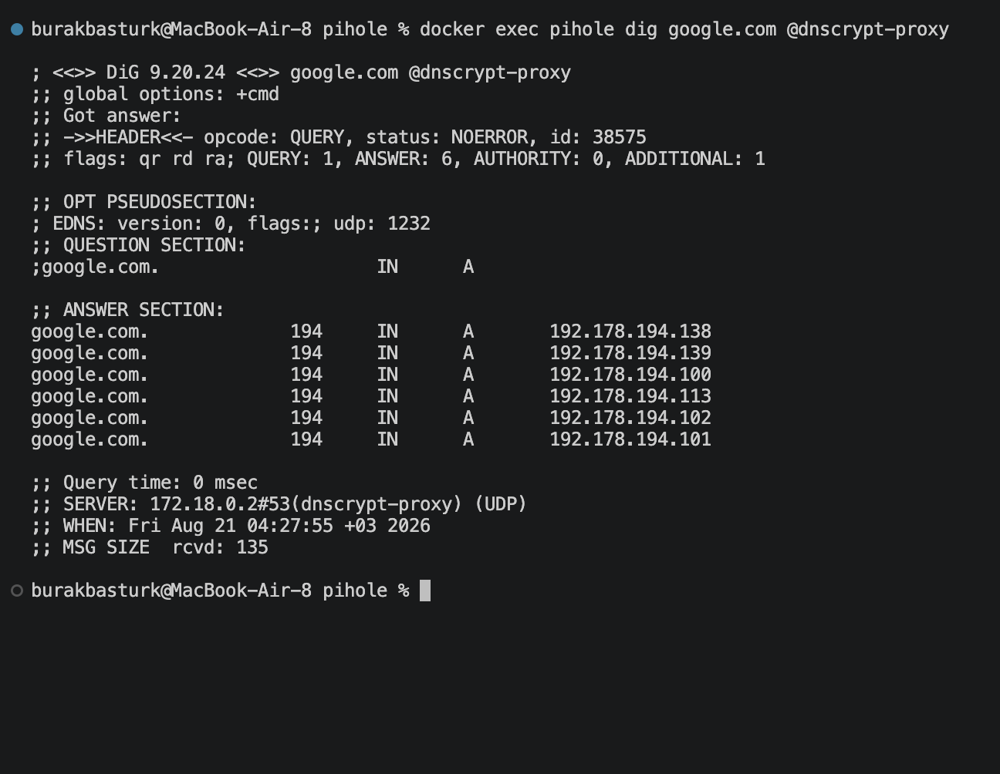
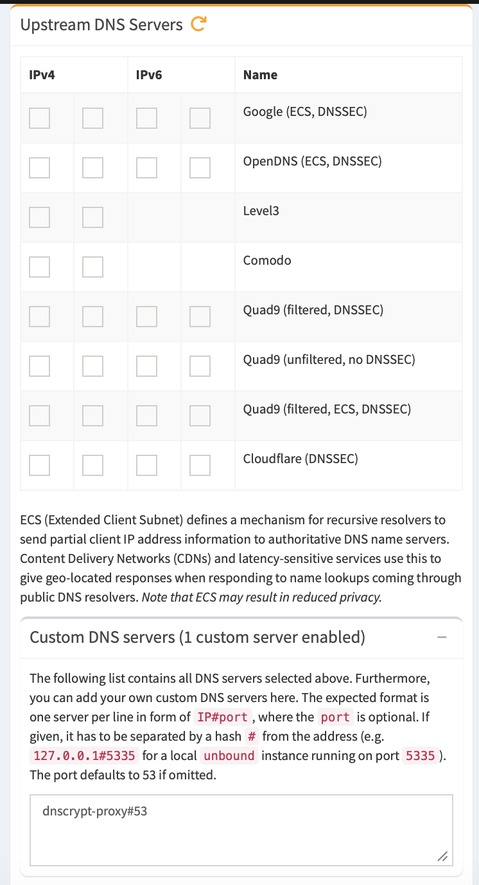

### Bug 3: DNSSEC validated twice, in a way that broke everything

With the networking fixed, one more thing stayed broken: DNS still hung, even though dnscrypt-proxy was now reachable. Disabling Pi-hole's DNSSEC toggle immediately fixed it.

The cause: Quad9's DNSCrypt server already validates DNSSEC before dnscrypt-proxy ever hands me a response — that's what "quad9-dnscrypt-ip4-filter-pri" with DNSSEC support means. But once it's validated, it doesn't pass along the raw signature data for Pi-hole to *independently* re-check. So Pi-hole asked for proof it could verify itself, got nothing usable back, and rejected every response as unverifiable. Turning Pi-hole's own DNSSEC setting off didn't remove DNSSEC protection — it just stopped a redundant, incompatible second check on top of validation that was already happening one layer earlier, at Quad9.

### What tied all three together

In every case, the fix came from checking what was actually happening — changelogs, container logs, a `dig` run from inside the exact container that was failing — rather than assuming the visible "healthy" status told the whole story. `docker ps` showing "Up" said nothing about whether DNS resolution actually worked; a resolver "supporting DNSSEC" said nothing about whether two DNSSEC-aware components could safely be stacked. That's the pattern I want to carry forward: verify the actual behavior, not the component that claims to provide it.

## What I'd Do Differently in Production

- Move it off my laptop and onto a Raspberry Pi on the network, same containers, so it protects every device instead of just this one machine.
- Add real monitoring (Grafana/Prometheus) instead of leaning on Pi-hole's built-in dashboard for anything longer than a quick glance.
- Look at running Unbound for true self-hosted recursion instead of trusting Quad9 as a third party — I made a deliberate call to skip that here (see threat model), but it's worth revisiting if this ever moves to protecting more than one machine.

## Reflection

The biggest thing I took away wasn't really about DNS specifically — it was how many layers of "this looks fine" I had to cut through before I found what was actually broken. cloudflared looked running. Pi-hole and dnscrypt-proxy both showed healthy in `docker ps`. Quad9 genuinely does support DNSSEC. None of those things were lies, exactly — they just weren't the same as "this is actually working end to end." Each bug only cracked open once I stopped trusting a status indicator and went and checked real behavior instead: a changelog, a log file, a `dig` run from inside the specific container that was failing.

It also changed how I think about picking a security protocol, and about stacking security features in general. I stopped asking "which one is more secure" as if there's one right answer, and started asking what each layer is actually built to defend against — and whether two layers doing the "same" job might quietly conflict rather than add up. DoH is built to blend into normal web traffic, which isn't something I needed on my own laptop. DNSSEC done at Quad9 and DNSSEC done again at Pi-hole looked like "extra security" on paper and was actually just breakage. That's the question I want to be asking by default on the next project: not just "is this secure," but "do I actually know what this is doing, and does it still make sense next to everything else I've already turned on."

## How to Run It Yourself

1. Install Docker Desktop (Apple Silicon build)
2. Clone this repo, `cp .env.example .env`, set a real password
3. `docker compose up -d`
4. Point your Mac's DNS (Network settings) at `127.0.0.1`
5. In Pi-hole, set the upstream to Custom DNS `dnscrypt-proxy#53` and leave DNSSEC off — see Bug 2 and Bug 3 above for why both of those are the way they are, not `127.0.0.1#5053` with DNSSEC on like I originally had it.

---

*Tags: cybersecurity, networking, self-hosting*